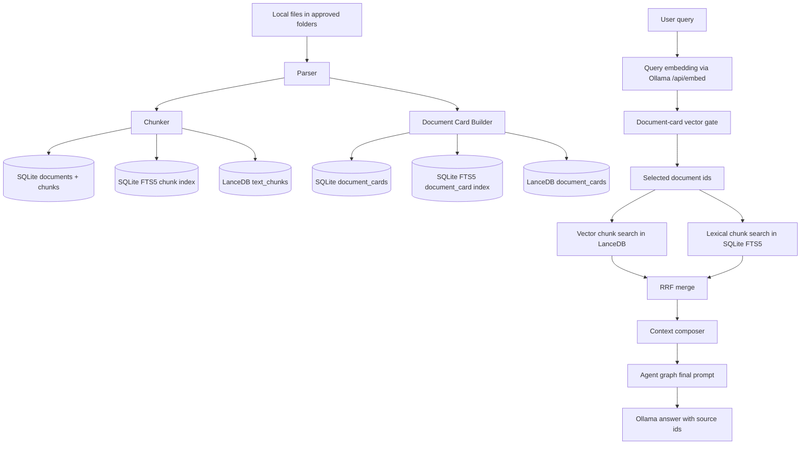

# RAG Logic

This file is the working map for the current Phase 3 RAG system. It is intentionally practical: it describes what the code does today, what is deliberately not implemented yet, and where quality problems usually come from.

## Current Shape

## Data Ingestion

1. A file is approved by folder scan or manual selected-file indexing.
2. `parsers.py` extracts plain text from `txt`, `md`, `pdf`, and `docx`.
3. `chunking.py` splits text into overlapping chunks.
4. `document_card.py` builds a coarse document-level card: title, short summary, topic tags, project tags, keywords, and document type.
5. SQLite remains the source of truth for files, documents, chunks, collections, and cards.
6. SQLite FTS5 indexes lexical search over chunks, files, and document cards.
7. LanceDB stores vector rows for document cards and text chunks.

## Retrieval

The current retrieval path is deliberately two-stage:

1. Embed the query.
2. Search document cards first to avoid searching every chunk blindly.
3. Select a limited set of document ids.
4. Search LanceDB text chunks inside those document ids.
5. Search SQLite FTS5 chunks inside the same document ids.
6. Merge vector and lexical candidates with Reciprocal Rank Fusion.
7. Compose a bounded source context for the agent.

This is closer to a lightweight hybrid RAG than full LightRAG or GraphRAG. We do not yet build an entity graph, relation graph, or community summaries.

## Why The First Broad Query Was Noisy

The earlier broad query mixed terms like `audio visual`, `fusion`, and `speech emotion recognition`. The system returned `Pitch-fusion` content too high because:

1. The document-card gate was too wide and selected too many documents.
2. The old tag matcher used substring matching, so short tags like `rag` could match unrelated text.
3. The agent path still used plain FTS instead of the new hybrid retrieval.
4. There was no context composer to cap repeated chunks and preserve source quality.

These are Phase 3 quality issues, not proof that chunking alone is broken.

## Chunking Status

Current chunking is acceptable for a first local RAG:

- It is paragraph/sentence aware.
- It uses overlap to preserve context across boundaries.
- It is simple and deterministic.

Known limitations:

- PDF page numbers are not preserved per chunk yet.
- Tables and figures are still folded into plain text.
- Chunk size is character-based, not tokenizer-based.
- Research-paper sections are not explicitly modeled.

The next chunking upgrade should add page/section metadata before changing the chunk size again.

## Agent Status

The agent graph is still intentionally thin:

- router
- planner
- final prompt builder

The important Phase 3 fix is that agent retrieval should use the hybrid retriever and context composer before final generation. Full research planning, multi-hop graph traversal, and global corpus synthesis belong to Phase 4.

## External Architecture Notes

- Classic RAG combines a generator with external retrieved knowledge so answers can use non-parametric memory instead of relying only on model weights.
- LanceDB recommends hybrid retrieval when both semantic similarity and exact keywords matter, and its default hybrid reranking pattern uses Reciprocal Rank Fusion.
- LightRAG adds graph structures and dual-level retrieval for low-level and high-level knowledge discovery.
- GraphRAG targets global corpus questions by extracting an entity graph and pregenerating community summaries.

References checked:

- RAG paper: https://nlp.cs.ucl.ac.uk/publications/2020-05-retrieval-augmented-generation-for-knowledge-intensive-nlp-tasks/
- LanceDB hybrid search: https://docs.lancedb.com/search/hybrid-search
- LanceDB reranking: https://docs.lancedb.com/reranking
- LightRAG paper page: https://huggingface.co/papers/2410.05779
- Microsoft GraphRAG: https://www.microsoft.com/en-us/research/publication/from-local-to-global-a-graph-rag-approach-to-query-focused-summarization/
- Ollama batch embeddings: https://docs.ollama.com/capabilities/embeddings

## Next Quality Steps

1. Add page number and section metadata to chunks.
2. Add table and figure chunk types.
3. Add optional reranker after RRF.
4. Add query classification: exact lookup, paper comparison, broad survey, or local agent project question.
5. Move full graph/entity retrieval to Phase 4.
