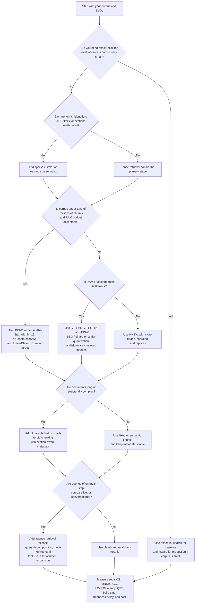

# Production-Grade Indexing for RAG and Agentic RAG

## Executive summary

For most production RAG agents in 2026, the best starting point is **hybrid retrieval**: a **sparse lexical index** such as BM25 or learned sparse retrieval, plus a **dense ANN index** such as HNSW, followed by a **reranker**. This combination is now the mainstream production pattern across Azure AI Search, Elasticsearch, OpenSearch, Vertex AI Vector Search, Pinecone, Qdrant, and Milvus because it balances semantic recall, exact-term precision, and operational flexibility better than any single index family alone. Azure explicitly fuses full-text and vector results with Reciprocal Rank Fusion; OpenSearch, Qdrant, Pinecone, Milvus, and Google also document hybrid or sparse+dense retrieval as a first-class pattern. citeturn6search4turn13search8turn14search1turn13search1turn6search6turn37search20

If your corpus is modest and your latency SLO is strict, **HNSW over dense embeddings** is still the default workhorse. The reason is simple: HNSW consistently offers an excellent speed/recall tradeoff, and it is the default or primary ANN path in Lucene/Elasticsearch, OpenSearch, Weaviate, Qdrant, Milvus, pgvector, and Amazon DocumentDB. The downside is that HNSW is relatively memory-hungry, slower to build than IVF-style methods, and insert-heavy workloads need careful tuning. citeturn29search0turn31search1turn9view2turn9view3turn10view0turn30search15turn6search3

When corpus size or RAM pressure dominates, the center of gravity shifts toward **compression and disk-aware indexing**: IVF-Flat, IVF-PQ, scalar quantization, binary quantization, on-disk HNSW, Elastic’s BBQ/DiskBBQ family, OpenSearch `on_disk` mode with rescoring, or SPANN/SPFresh-inspired designs such as Weaviate’s HFresh. In other words, large-scale production retrieval increasingly uses a two-stage pattern even inside the index itself: search a compressed or partitioned structure first, then rescore a smaller candidate set using higher-fidelity vectors. citeturn28view0turn28view1turn25view3turn31search2turn31search10turn11search2turn11search17turn29search1turn29search6

For your agent, the practical recommendation is: **store normalized, deduplicated, structure-aware chunks with rich metadata; build both sparse and dense representations; use HNSW for dense retrieval until scale or budget forces IVF/compression; always measure recall@k and latency P95 against an exact baseline; and reserve full agentic multi-hop retrieval for queries that are actually compositional or ambiguous.** That stack gives the best balance of speed, accuracy, and scalability in current production systems. citeturn25view1turn36search1turn21search0turn9view4turn16search8turn38view0turn39view1

## Design principles for production retrieval

Production indexing for RAG is no longer “pick a vector DB and store embeddings.” Mature systems separate at least four concerns: **candidate generation**, **filtering**, **reranking**, and **grounding/citation output**. Vector indexes accelerate semantic candidate generation; inverted or payload indexes make filters and ACLs cheap; rerankers repair first-stage recall noise; and the application layer must preserve parent-child provenance so the LLM sees coherent passages and can cite them. Qdrant’s docs are especially direct that vector search alone is not enough when filtering matters, and Azure’s chunking/projection design explicitly models parent-child relationships for chunked retrieval. citeturn9view4turn36search1turn36search4

The most important production tradeoff is **exactness versus approximation**. Exact search gives perfect recall but scales poorly; pgvector states this plainly, and Faiss positions its exact `Flat` indexes as brute-force baselines. Approximate nearest neighbor indexes trade recall for speed, which is acceptable only if you measure that trade on your own data. This is why ANN-Benchmarks and vendor benchmark suites emphasize recall-latency curves instead of single “faster/slower” claims. citeturn10view0turn27view0turn16search8turn25view2

A second production rule is that **metadata is part of the index design, not an afterthought**. In RAG, metadata drives freshness ranking, tenant isolation, ACL enforcement, source attribution, and selective retrieval by type, recency, jurisdiction, product line, or document status. Qdrant documents payload indexes for keyword, numeric, geographic, text, datetime, and UUID fields, while AWS Bedrock’s knowledge-base ingestion associates metadata with each chunk, and Azure supports document-level permission metadata in push indexing. citeturn9view4turn23search8turn20search10

A third rule is that **chunking is inseparable from index quality**. Azure, Unstructured, Pinecone, and Databricks all now frame chunking as a primary retrieval-quality lever. Long chunks hide facts; tiny chunks destroy context; poor boundaries hurt both dense and sparse retrieval; and missing parent pointers make answer assembly fragile. That is why production systems increasingly use structure-aware chunking, parent-child indexing, and sometimes separate child and parent retrieval stages. citeturn36search1turn21search0turn21search4turn25view1turn36search7

## Index families and recommended configurations

The table below is a **synthesis** of current official documentation and algorithm papers. Relative ratings such as “high” or “medium” are judgment calls that combine the documented mechanics, memory formulas, and observed production guidance from Faiss, Lucene/Elasticsearch, OpenSearch, Weaviate, Qdrant, Milvus, pgvector, and cloud search vendors. Exact rankings vary by dimension, filter selectivity, concurrency, and hardware. citeturn27view0turn27view2turn10view0turn25view3turn31search2turn9view3turn9view4turn30search8

| Index family | What it is | Speed | Accuracy / recall ceiling | Memory footprint | Update cost | Best use | Representative production adopters / systems |
|---|---|---:|---:|---:|---:|---|---|
| **Exact flat dense** | Brute-force scan over full vectors | Low at scale | Perfect | High: Faiss `Flat` uses `4*d` bytes per vector | Low to medium | Ground-truth evaluation, small corpora, strict correctness | Faiss `IndexFlat*`, pgvector exact kNN, Lucene flat vectors citeturn27view0turn10view0turn31search4 |
| **HNSW** | Graph ANN over dense vectors | Very high | High | High due to graph + vectors | Medium to high on heavy writes | Default dense ANN for most RAG stacks up to tens of millions of chunks | Lucene/Elasticsearch, OpenSearch, Azure AI Search, Weaviate, Qdrant, Milvus, pgvector, Amazon DocumentDB citeturn31search1turn9view2turn6search8turn9view3turn30search15turn10view0turn6search3 |
| **IVF-Flat** | Cluster vectors into posting lists, search a subset | High | Medium to high | Medium | Lower than HNSW | Large corpora when RAM matters more than absolute recall | Faiss, pgvector, Milvus, Amazon DocumentDB citeturn27view0turn27view2turn9view5turn30search1turn6search3 |
| **IVF-PQ / IVFADC** | IVF plus compressed PQ codes | Very high | Medium | Low to medium | Medium | Very large corpora under RAM pressure | Faiss, Milvus, OpenSearch Faiss engine citeturn28view0turn28view1turn9view2turn30search5 |
| **Scalar / binary / rotational quantization** | Compress vectors while preserving approximate distance | High | Medium to high depending on rescoring | Low | Medium | Cost reduction and better cache fit | Weaviate RQ/PQ/SQ/BQ, Qdrant SQ/BQ/TurboQuant, Elastic BBQ, OpenSearch `compression_level` citeturn8search0turn8search19turn17search13turn31search10turn25view3 |
| **Sparse inverted index** | BM25 or learned sparse vectors / postings | Very high on lexical queries | High for exact terms, weaker on paraphrase alone | Low to medium | Low | Terms, identifiers, compliance, product codes, short keyword queries | Lucene, Elasticsearch, OpenSearch, Azure AI Search, Milvus BM25, Elastic ELSER, Pinecone sparse indexes citeturn37search2turn25view4turn13search13turn12search0turn14search11 |
| **Hybrid sparse+dense** | Fuse sparse and dense results, usually with RRF | High | Very high in practice | Medium to high | Medium | Best default for enterprise RAG | Azure AI Search, Elasticsearch/OpenSearch, Vertex AI, Pinecone, Qdrant, Milvus citeturn6search4turn15search12turn13search8turn14search1turn13search1turn6search6 |
| **Hierarchical parent-child / small-to-big** | Retrieve small chunks, expand to parent sections or documents | Medium | High answer quality | Medium | Medium | Long documents, contracts, manuals, PDFs | Azure AI Search index projections, Databricks parent-child chunking, LangChain/LlamaIndex ecosystems citeturn36search1turn36search4turn36search7 |
| **Disk-aware / memory-tiered ANN** | Search compressed or clustered index, then rescore full vectors from disk | Medium to high | High with rescoring | Low RAM, higher disk IO | Medium | Hundred-million to billion-scale corpora | OpenSearch `on_disk`, Elastic DiskBBQ/BBQ HNSW, SPANN/SPFresh-derived HFresh, Milvus disk-aware large-scale paths citeturn25view3turn31search0turn31search2turn11search2turn11search17turn29search1turn29search6 |
| **Semantic hashing / LSH / binary-code retrieval** | Hash vectors or texts into compact binary codes and search in Hamming space | Very high | Usually lower than modern HNSW/hybrid | Very low | Low to medium | Extreme compression, candidate generation, niche workloads | Faiss `IndexLSH`; emerging Hash-RAG research, but not the dominant enterprise default citeturn27view3turn17search12turn17search0 |

Dense-only retrieval is usually not enough for production enterprise content because dense embeddings miss exact identifiers, versions, acronyms, and rare tokens that BM25 or learned sparse retrieval can preserve. OpenSearch and Azure both explicitly position hybrid retrieval as the way to combine keyword precision with semantic matching, and Elastic’s semantic stack also keeps BM25 or RRF as the first-stage ranker before semantic reranking. citeturn37search13turn6search4turn25view4

### Dense ANN variants in practice

HNSW remains the safest default because it combines high recall with low latency and has become the de facto implementation inside Lucene-based systems and most vector databases. Faiss describes its key knobs as `M`, `efConstruction`, and `efSearch`; pgvector uses the same conceptual controls and documents defaults of `m=16`, `ef_construction=64`, and `ef_search=40`, while warning that higher values improve recall at the cost of memory, build time, and query latency. citeturn27view2turn10view0turn10view1turn10view2

IVF-style indexes matter when HNSW no longer fits your RAM budget or when ingestion cost is high. Faiss’s rule of thumb is `nlist ≈ C * sqrt(n)`, with `nprobe` chosen at query time to dial recall versus speed, and pgvector suggests starting with `lists = rows/1000` up to 1M rows or `sqrt(rows)` over 1M rows, with probes starting around `sqrt(lists)`. Those heuristics are still very practical for medium and large corpora. citeturn27view2turn9view5

Product quantization is still the standard compression workhorse for large-scale dense retrieval. Faiss shows why: a flat float32 vector needs `4*d` bytes, while `IndexPQ` or `IndexIVFPQ` replaces that with compact codes such as `ceil(M*nbits/8)` bytes per vector, plus small IVF metadata. This is why IVF-PQ remains compelling whenever storage and cache behavior are the bottleneck rather than absolute top-end recall. citeturn27view0turn28view1turn28view2

### Sparse, BM25, and learned sparse retrieval

Sparse retrieval is still the best first-stage engine for **exact-match semantics**: product SKUs, law citations, error codes, clause numbers, person names, chemical strings, and any query where missing a rare token is unacceptable. OpenSearch states that BM25 is its default keyword scoring algorithm, and Azure semantic ranking also assumes an initial BM25- or RRF-ranked set before L2 reranking. citeturn37search2turn37search15turn25view4

Learned sparse retrieval is increasingly production-relevant where you want lexical interpretability plus some semantic generalization. Elastic’s ELSER is a production sparse encoder; Pinecone now supports sparse-only indexes for BM25 and learned sparse models; Qdrant documents SPLADE and related sparse pipelines; and BGE-M3 is notable because one model can produce dense, sparse, and multi-vector representations. The main caveat is operational: learned sparse often improves zero-shot retrieval but can be slower or larger than classical BM25. citeturn12search0turn12search3turn14search11turn13search16turn29search3turn29search15turn12search6

### Hybrid retrieval and hierarchical retrieval

Hybrid retrieval is the current production default because it lets you recover exact tokens and semantic paraphrases in one pipeline. Azure runs full-text and vector search in parallel and merges with RRF; Qdrant supports fusion of dense, sparse, and multi-vector results with RRF or distribution-based fusion; Milvus supports BM25 plus dense vector search; and Pinecone’s hybrid approach allows adjusting the dense-sparse weight. citeturn6search4turn13search8turn13search13turn14search1

Hierarchical retrieval is now best understood as **small-to-big retrieval**, not just “use HNSW because it is hierarchical.” The production pattern is: index fine-grained child chunks for precision, store parent sections or full documents for expansion, retrieve children, then hand parents or stitched sections to the reranker or reader. Azure’s semantic chunking and index projection docs explicitly model this one-to-many parent-child design, and Databricks recommends child chunks around 512 tokens with larger 2048-token parents as a starting pattern. citeturn36search1turn36search4turn36search7turn25view1

## Embeddings, chunking, and indexing pipelines

The embedding-model market now gives you a real production choice between **smaller, cheaper general-purpose models**, **larger multilingual flagships**, and **task- or format-specific models**. OpenAI’s `text-embedding-3-small` defaults to 1536 dimensions and `text-embedding-3-large` to 3072, both with up to 8192 input tokens; OpenAI also explicitly supports shortening vectors with the `dimensions` parameter and reports that a shortened 256-dimensional `text-embedding-3-large` vector can still outperform `text-embedding-ada-002` at 1536 dimensions on MTEB. citeturn35view0turn32search1

Cohere’s `embed-v4.0` emphasizes **multimodality and long context**, with configurable dimensions from 256 to 1536 and 128k context, and its Bedrock documentation also exposes float, int8, uint8, binary, and ubinary output forms. That makes it attractive when your corpus includes PDFs, images, or visually rich documents and when you want lower-precision representations directly from the model side. citeturn33view1turn33view2turn33view0

Voyage’s current family is unusually strong for production because it separates **document embedding quality** from **query serving cost**. Official docs list `voyage-4-large`, `voyage-4`, and `voyage-4-lite` at 32k context with 1024 default dimensions and optional 256/512/2048 dimensions. Voyage’s January 2026 release also introduced a shared embedding space across the family, which means you can embed documents once with a more accurate model and serve queries with a cheaper one without re-embedding the corpus. That asymmetric deployment pattern is especially attractive for high-query-volume agents. citeturn33view5turn34view0

BGE-M3 remains one of the most interesting open models because it unifies **dense retrieval, sparse retrieval, and multi-vector retrieval** in one multilingual model with support for more than 100 languages and up to 8192 tokens. Jina’s `jina-embeddings-v4` pushes even further toward agentic/document retrieval: it supports visually rich documents, dense and late-interaction retrieval, 32k context, a 2048-dimensional single vector, and 128-dimensional multi-vectors. These are excellent choices when your agent must retrieve from complex PDFs, tables, diagrams, or code-heavy corpora and you want open or semi-open deployment options. citeturn29search3turn29search15turn33view3turn33view4

### Embedding model tradeoff matrix

This table focuses on **operational tradeoffs**, not absolute leaderboard rankings. Public benchmark signals are either official model docs or vendor-reported evaluations; they are directionally useful, but you should still benchmark on your own corpus. citeturn35view0turn33view1turn33view5turn34view0turn29search3turn33view3

| Model family | Default dimensions | Optional shorter dimensions | Max input / context | Strengths | Tradeoffs | Best fit |
|---|---:|---|---:|---|---|---|
| **OpenAI text-embedding-3-small** | 1536 | Yes | 8192 | Cheap, solid general retrieval, easy API integration, good baseline MTEB score from official docs | Less headroom than flagship models | Small/medium corpora, quick time-to-value, cost-sensitive query embedding citeturn35view0 |
| **OpenAI text-embedding-3-large** | 3072 | Yes | 8192 | Higher accuracy, strong multilingual performance, shortening support | Larger vectors increase memory, storage, and ANN cost unless shortened | Quality-first dense retrieval; can be shortened for cost control citeturn35view0 |
| **Cohere embed-v4.0** | 1536 | 256/512/1024 | 128k | Multimodal, long-context, configurable output precision | Heavier than light text-only models; quality depends on corpus modality | PDFs, multimodal search, enterprise docs with images/tables citeturn33view1turn33view2 |
| **Voyage 4 family** | 1024 | 256/512/2048 | 32k | Strong retrieval quality, shared embedding space across model sizes, Matryoshka + quantization support | Vendor-reported flagship gains should be verified on your data | High-scale systems where document/query embedding costs differ materially citeturn33view5turn34view0 |
| **BGE-M3** | model-dependent dense output | n/a in paper summary | 8192 | Dense + sparse + multi-vector in one multilingual model | More engineering complexity if you actually use all three modes | Advanced hybrid or late-interaction retrieval, open deployment citeturn29search3turn29search15 |
| **Jina Embeddings v4** | 2048 single-vector | 128/256/512/1024/2048 | 32k | Strong for visually rich docs, late interaction, multilingual multimodal retrieval | Larger model footprint and more complex serving path | Agentic RAG over PDFs, diagrams, manuals, code-and-doc mixed corpora citeturn33view3turn33view4 |

### Chunking and preprocessing pipeline

A strong production indexing pipeline usually looks like this:

**parse → clean → normalize → deduplicate → segment → enrich metadata → embed → index sparse + dense → validate**. That ordering is consistent with Unstructured’s document-element-first approach, Azure’s semantic chunking guidance, and Databricks’ retrieval-quality recommendations. Unstructured also recommends chunking after layout-aware enrichment such as image or table descriptions, which is important for visually rich documents. citeturn21search0turn21search8turn36search1turn25view1

For chunk size, there is no universal optimum, but current official guidance is converging on a practical search space rather than a magic number. Bedrock’s default managed chunking is about **300 tokens**, Azure emphasizes semantic/structure-based segmentation, and Databricks recommends starting experiments around **256**, **512**, and **1024** tokens, with **parent-child** variants such as **512-token children** under **2048-token parents**. Those ranges are well aligned with what many strong RAG systems use in practice. citeturn23search11turn36search1turn25view1turn36search7

For metadata, keep at least: `doc_id`, `chunk_id`, `parent_id`, source URI, title, section header, timestamp or validity interval, tenant, ACL fields, language, modality, and a stable content hash. Qdrant’s payload-index guidance shows why this matters for filtering efficiency, and Azure and AWS both show how chunk metadata travels with indexed content. citeturn9view4turn20search10turn23search8

For normalization and deduplication, production teams should normalize Unicode, whitespace, boilerplate, and repeated headers/footers; de-duplicate near-identical chunks; and preserve stable IDs so updates can be applied as merges/upserts instead of full re-ingestion. Bedrock’s agentic retrieval explicitly returns deduplicated chunks, and AWS’s agentic AI cost guidance warns against paying tokens on duplicate or superseded information. citeturn38view2turn39view1turn23search6

### Recommended starting configurations by corpus size

The matrix below is prescriptive rather than canonical; it is a synthesis of vendor defaults, algorithm papers, and operational guidance.

| Corpus size | Recommended stack | Dense index start point | Sparse layer | Reranking | Why this usually wins |
|---|---|---|---|---|---|
| **Small** under ~1M chunks | Hybrid, but keep exact baseline in testing | Exact flat for eval; HNSW in prod if P95 matters | BM25 | Optional but valuable | Small corpora can afford exact evaluation; HNSW gives low latency with little tuning overhead citeturn10view0turn27view0turn6search4 |
| **Medium** from ~1M to ~50M chunks | Hybrid + reranker | HNSW with `M≈16`, `efConstruction≈64`, `efSearch≈64–128` as a tuning range | BM25 or learned sparse | Yes | This is today’s default enterprise RAG shape; hybrid + rerank usually outperforms dense-only and sparse-only citeturn10view0turn10view1turn25view4turn24search13 |
| **Large** above ~50M chunks or RAM-constrained | Hybrid + compressed or disk-aware ANN | IVF-Flat, IVF-PQ, on-disk HNSW, BBQ, HFresh/SPANN-like | BM25 or learned sparse | Yes, often essential | Compression and partitioning cut RAM sharply; rescoring restores quality on the final candidate set citeturn28view1turn25view3turn31search10turn11search2turn29search6 |
| **Very high update rates** | Hybrid with update-friendly write path | HNSW only if write budget allows; otherwise IVF or segment-based systems | BM25 / inverted index | Yes | Graph rebuilds are expensive; segment- or partition-based systems absorb churn more gracefully citeturn10view0turn29search1turn19search0 |
| **Filter-heavy multitenant** | Hybrid with strong metadata indexes | HNSW or IVF plus filter-aware engine | BM25 | Yes | Filter selectivity often dominates pure vector math, so payload/inverted indexes matter disproportionately citeturn9view4turn31search9turn20search10 |

## Real-time ingestion, scaling, and cost control

Ingestion strategy should be chosen separately for **initial bulk load** and **steady-state updates**. Pinecone explicitly recommends **bulk import rather than upsert** for millions of records or hundreds of GB, and Azure AI Search distinguishes push-based indexing from indexer-based pull and incremental models. This pattern generalizes well: bulk-build your base corpus, then stream the delta. citeturn19search1turn19search5turn20search2turn20search12

For steady-state updates, the safest production mechanisms are **append/merge/upsert** for incremental changes and **blue-green migration** for schema or embedding-model changes. Azure supports incremental indexing and change tracking; Qdrant documents blue-green collection migration and blue-green cluster deployment for zero-downtime upgrades; Elasticsearch and OpenSearch both support reindexing into a new destination index, which is the usual path for schema changes or index definition changes. citeturn20search0turn20search4turn20search17turn19search0turn19search4turn19search11turn19search7

If your agent’s knowledge changes frequently, you should plan for **re-embedding and index migration** as a first-class lifecycle event. Qdrant’s recommended blue-green migration pattern writes updates to both old and new collections during re-embedding, then flips read traffic once the new corpus is ready. That is a strong default pattern whenever embedding models, chunking policy, or metadata schema changes. citeturn19search0turn19search4

On sharding and replication, the production principle is straightforward: **shards distribute data and load; replicas increase read throughput and fault tolerance; too many replicas increase cost and can degrade write efficiency.** Qdrant, Weaviate, Pinecone, and Elasticsearch all document this pattern explicitly. Qdrant recommends at least one shard or replica per node for scale distribution; Pinecone’s dedicated read nodes and replicas are designed for higher throughput and predictable latency; and Elasticsearch replicates primary shards into replica shards within each replication group. citeturn18search8turn18search0turn18search4turn18search1turn18search13turn18search22

Cost is dominated by five factors: **embedding generation, vector dimensionality, ANN structure overhead, filter index overhead, and reranking/token spend**. OpenAI’s docs explicitly note that larger embeddings consume more compute, memory, and storage, while Faiss shows the basic memory formulas for flat, HNSW, and PQ-style indexes. Compression then changes the economics substantially: Weaviate’s 8-bit rotational quantization claims up to 4x compression with near-perfect recall on many datasets; Qdrant documents up to 32x compression with binary quantization or TurboQuant-style methods; OpenSearch defaults its disk mode to 32x compression with rescoring; and Elastic recommends BBQ for many text-embedding workloads. citeturn35view0turn27view0turn28view1turn8search19turn17search13turn25view3turn31search10

For an illustrative benchmark from a managed production system, Databricks currently documents **standard endpoints** at roughly **20–50 ms** with **30–200+ QPS** and **storage-optimized** endpoints at roughly **300–500 ms** with **30–50 QPS**, while also stating that storage-optimized can be **up to 7x cheaper per vector**. Those are platform-specific numbers, not universal truths, but they are a useful reminder that there is usually a steep cost/latency frontier between “hot RAM-centric ANN” and “cheap storage-centric ANN.” citeturn25view0

## Evaluation and benchmarking protocol

The minimum serious evaluation loop for RAG indexing has two parts: **retrieval quality** and **systems quality**. Retrieval quality should include **recall@k** against an exact baseline for ANN tuning, plus **MRR@k**, **NDCG@k**, or task-specific answer-hit rates against human relevance labels. Systems quality should include **mean latency**, **P95/P99 latency**, **QPS under concurrency**, **import/build time**, and **memory/storage footprint**. Weaviate’s benchmark methodology is a good template because it reports Recall@10/100, QPS, mean latency, P99 latency, and import time together. citeturn25view2

For offline model/index comparison, use **BEIR-style retrieval tasks** or explicit domain relevance sets, but do not trust generic leaderboards alone. BEIR exists precisely because model quality varies across heterogeneous retrieval tasks, and vendor-specific evaluations often use different datasets or metrics. For ANN algorithm testing, ANN-Benchmarks remains the standard reference environment for recall-speed tradeoff measurement. citeturn16search7turn16search1turn16search8

A strong offline protocol for your agent looks like this:

| Layer | Metric | Why it matters |
|---|---|---|
| ANN index | **Recall@10 / Recall@50** versus exact flat search | Tells you whether HNSW/IVF/quantization is dropping the right neighbors before reranking even starts citeturn16search8turn25view2turn10view0 |
| Retrieval stack | **MRR@10 / NDCG@10 / Hit@k** | Measures whether the right chunk is near the top, which matters more than raw ANN recall for RAG usefulness citeturn34view0turn34view1turn16search7 |
| System | **P50 / P95 / P99 latency**, **QPS**, **build/import time** | Captures user experience and operational efficiency under load citeturn25view2turn25view0 |
| Cost | **embedding cost**, **bytes/vector**, **storage footprint**, **token usage for reranking** | Prevents “accurate but unaffordable” designs citeturn35view0turn27view0turn24search9turn38view0 |
| Freshness | **ingest-to-search delay** and **update failure rate** | Crucial for agents grounded in changing corpora citeturn20search0turn20search8turn19search5 |

For rerankers, test them separately. Databricks documents that its built-in reranker can rerank **50 results in under 1 second** in typical workloads and as fast as **~250 ms** for shorter chunks, but it also notes that such latency is not suitable for every high-QPS search-bar scenario. That illustrates the broader production rule: reranking is often a clear win for RAG agents, but it should be budgeted explicitly. citeturn25view1

## Agentic RAG retrieval patterns

Classic RAG is still the right baseline: **retrieve once, optionally rerank, then read/generate**. Azure calls this the classic single-query pipeline, and Pinecone’s RAG guidance and reranking guidance still treat retrieval-then-rerank as the most practical general pattern. This is the right default for straightforward fact lookup, policy QA, internal docs search, and most assistive copilots. citeturn36search19turn14search14turn21search13

Agentic RAG becomes worthwhile when the query is **multi-part, ambiguous, conversationally dependent, or requires tool-mediated expansion**. In Azure AI Search, agentic retrieval is a multi-query pipeline that can use an LLM to break a complex query into focused subqueries, execute them in parallel as keyword, vector, or hybrid searches, semantically rerank each branch, and then synthesize a unified response. Azure is also explicit that this adds latency relative to a single-query pipeline, which is an important operational constraint. citeturn38view0

Amazon Bedrock’s `AgenticRetrieveStream` documents the same broad pattern from another angle: planning, retrieval, optional full-document expansion, response generation, and streamed trace events. It decomposes complex queries into subqueries, iteratively evaluates whether the retrieved evidence is sufficient, can fetch full documents when needed, deduplicates retrieval results across iterations, and streams citations and trace events for observability. That is close to the ideal shape for an agent whose skill is retrieval rather than freeform generation. citeturn39view0turn39view1turn39view2turn38view2

A useful production taxonomy is:

| Pattern | What the agent does | When to use | Index implications |
|---|---|---|---|
| **Retrieval-then-read** | One retrieval pass, possibly hybrid | Simple fact lookup, low latency targets | Dense + sparse hybrid is usually enough citeturn6search4turn14search14 |
| **Retrieve-and-rerank** | First-stage candidate generation, second-stage relevance model | Default enterprise QA | Keep first-stage recall high; tune reranker budget separately citeturn24search13turn24search2turn25view1 |
| **Multi-hop / query decomposition** | Break user request into subqueries and merge evidence | Comparisons, constraints, compositional questions | Strong metadata, parent-child expansion, and observability become more important citeturn38view0turn39view0 |
| **Tool-mediated retrieval** | Decide whether to call retrieval, rerank, or external tools | Agentic workflows, long tasks, external data sources | Retrieval must return stable IDs, provenance, and machine-readable traces citeturn26search11turn39view2 |
| **Grounded answer with citations** | Return answer spans mapped to sources | Regulated or high-trust environments | Preserve chunk-to-source lineage and answer-span citation mapping citeturn26search3turn26search7turn39view2 |

For your use case—an agent whose task/skill is RAG—the best production starting pattern is usually:

**hybrid retrieval → rerank top 20–100 → expand parent sections if necessary → answer with citations → escalate to agentic decomposition only when the query classifier predicts compositionality or when first-pass confidence is low.** That pattern keeps the common path fast while preserving a stronger fallback for hard queries. Azure and Bedrock’s agentic retrieval docs support this staged view, and Pinecone explicitly notes that fully agentic RAG is more expensive in both tokens and time. citeturn38view0turn39view1turn36search14

## Decision flow for choosing an index

The following flowchart is intentionally pragmatic. It is designed for system design decisions, not academic taxonomy.

### Recommended choices by constraint

If your primary constraint is **lowest latency**, choose **HNSW plus hybrid sparse retrieval**, keep chunks small-to-medium, and only rerank a small candidate set. If the main constraint is **corpus size or RAM**, move toward **IVF-PQ, on-disk HNSW, binary/scalar quantization, or disk-aware clustered designs** with rescoring. If the main constraint is **update frequency**, prefer simpler or segment-friendly write paths, blue-green migrations for re-embedding, and engines with incremental indexing support. If the main constraint is **trustworthiness**, prioritize metadata, parent-child lineage, and citation-capable answer generation over absolute ANN speed. citeturn10view0turn25view3turn19search0turn20search0turn26search3turn39view2

### Final prescriptive recommendation

If I were designing a production RAG skill for an agent today, I would start with this stack:

| Layer | Recommendation | Rationale |
|---|---|---|
| **Chunking** | Structure-aware semantic chunking; test 256/512/1024-token children and optional 2048-token parents | Best balance of precision and context; aligns with Azure, Unstructured, Databricks, and Bedrock guidance citeturn36search1turn21search0turn25view1turn23search11 |
| **Metadata** | Rich payload fields with stable IDs, parent IDs, timestamps, tenant/ACL, language, source URI | Required for filters, grounding, updates, and agent observability citeturn9view4turn20search10turn23search8 |
| **Sparse retrieval** | BM25 first, then consider learned sparse for difficult domains | Strong exact-term recall with lower operational complexity citeturn37search2turn12search0turn14search11 |
| **Dense retrieval** | HNSW as default; IVF-PQ or on-disk compressed ANN when RAM or scale forces it | Best general speed/recall tradeoff until scale changes economics citeturn29search0turn10view0turn28view1turn25view3 |
| **Fusion** | Hybrid fusion with RRF or equivalent | Best production default for mixed lexical + semantic needs citeturn6search4turn13search8turn15search12 |
| **Reranking** | Always test a reranker on top-20 to top-100 candidates | Usually the cheapest quality win for enterprise RAG citeturn24search13turn24search2turn25view1 |
| **Agent mode** | Use classic retrieval-then-rerank by default; escalate to agentic decomposition only for hard queries | Preserves latency on the common path and accuracy on complex requests citeturn38view0turn39view1turn36search14 |
| **Evaluation** | Maintain exact-search baseline, monitor recall@k, MRR/NDCG, P95/P99 latency, ingest freshness, and cost per query | Prevents silent regressions and makes ANN tuning defensible citeturn16search8turn25view2turn25view0 |

That stack is the closest thing to a current “production default” across major cloud and OSS retrieval platforms: **hybrid indexing, structure-aware chunks, metadata-first design, ANN tuned against an exact baseline, and agentic retrieval used selectively rather than universally.** citeturn6search4turn9view4turn38view0turn38view2turn25view4